# Final Project Proposal
##League Of Legends Counterpick Programme

###Three souces that I am going to use. 
I am going to use chatGPT for my project
As Professor rome told us to be specific other than chatGPT, I searched specific things that I wanted to know. 
- Good Project
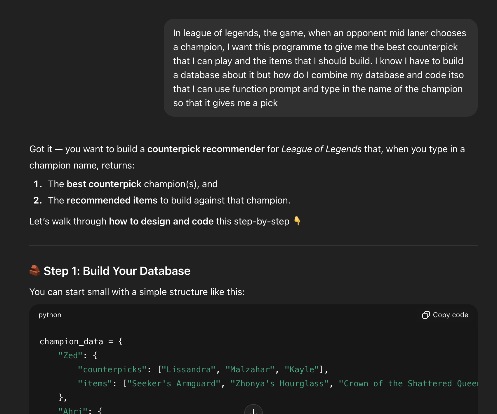
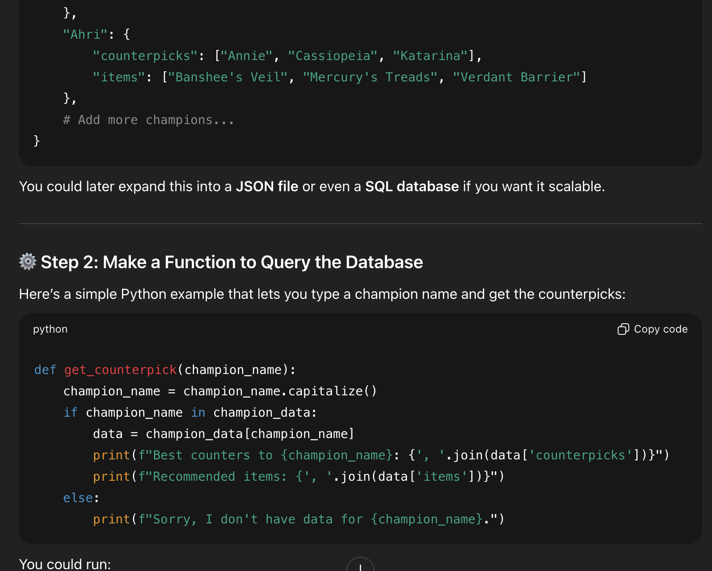
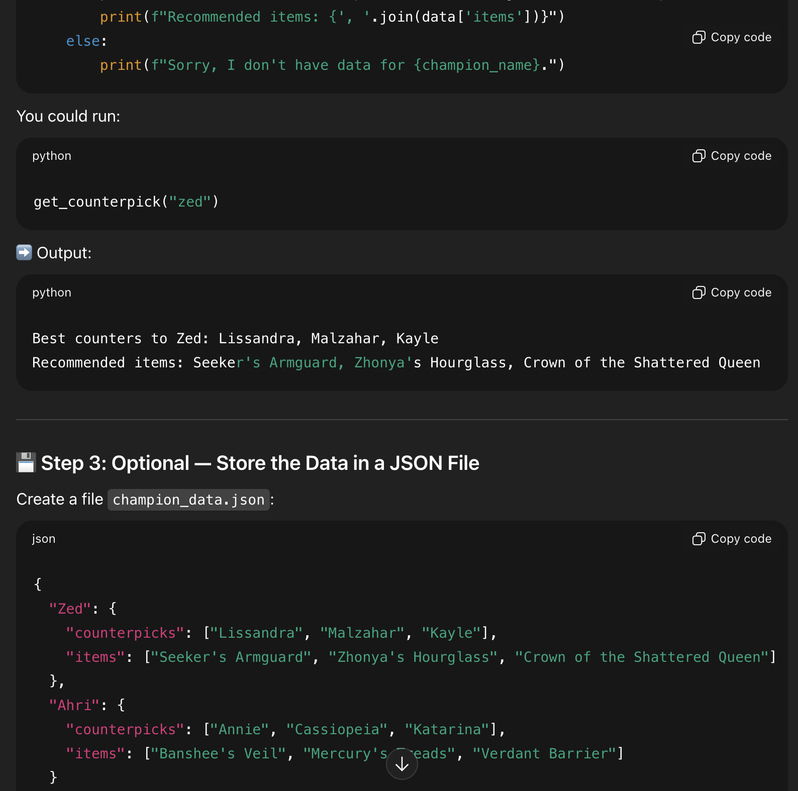
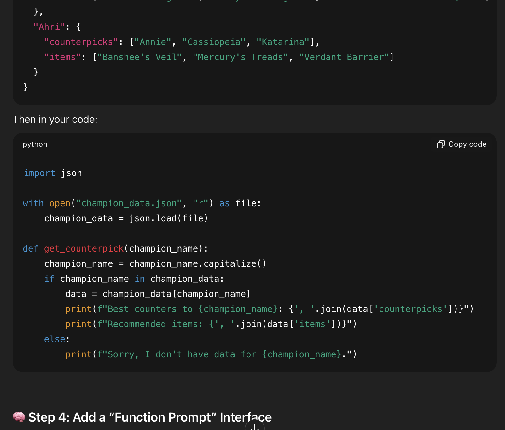
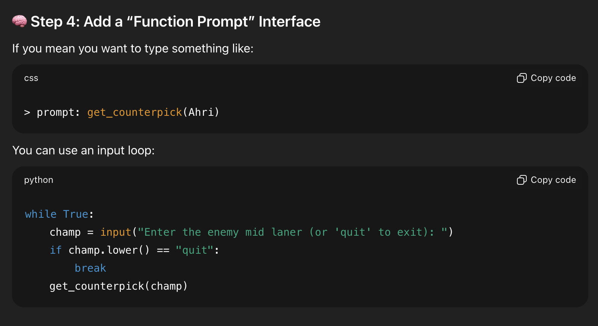

- Better Project
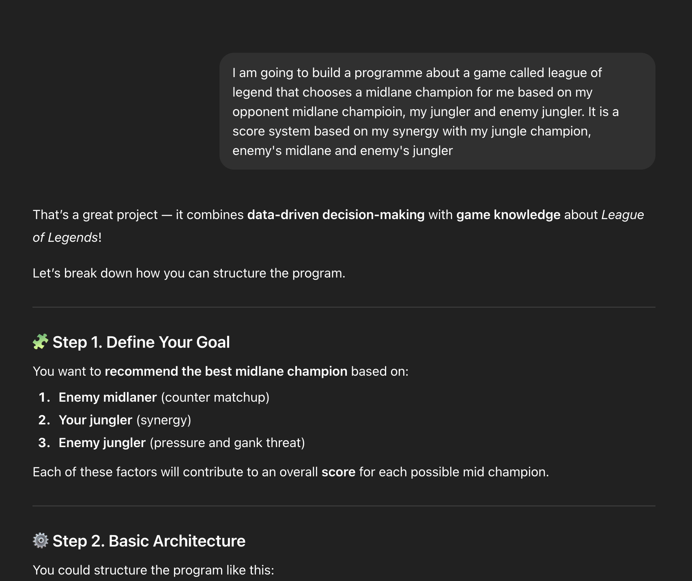
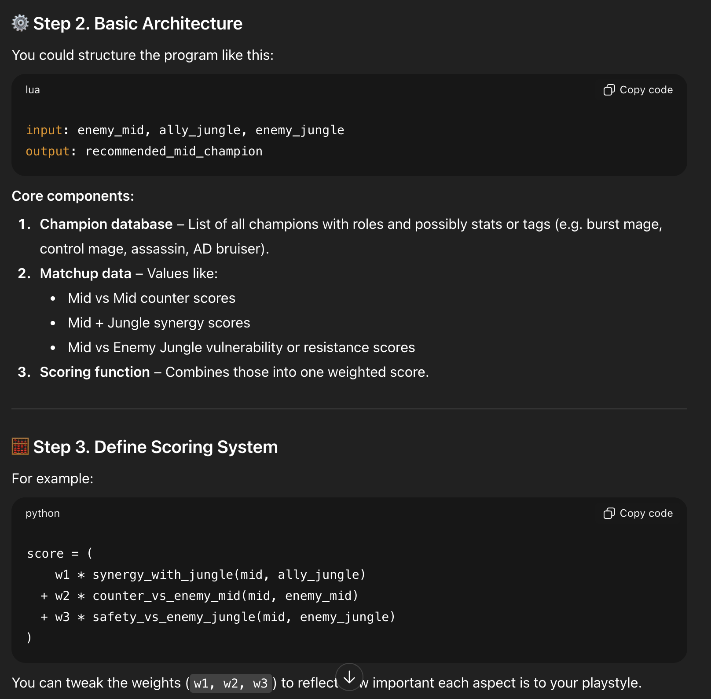
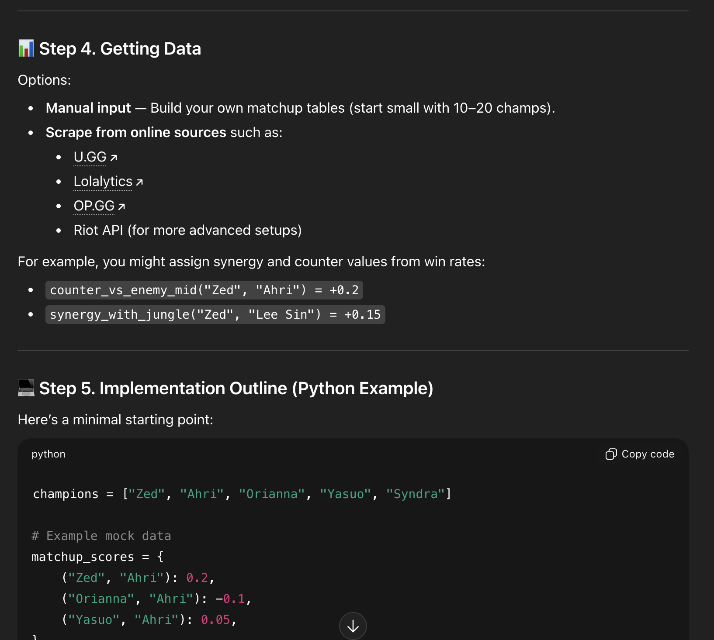
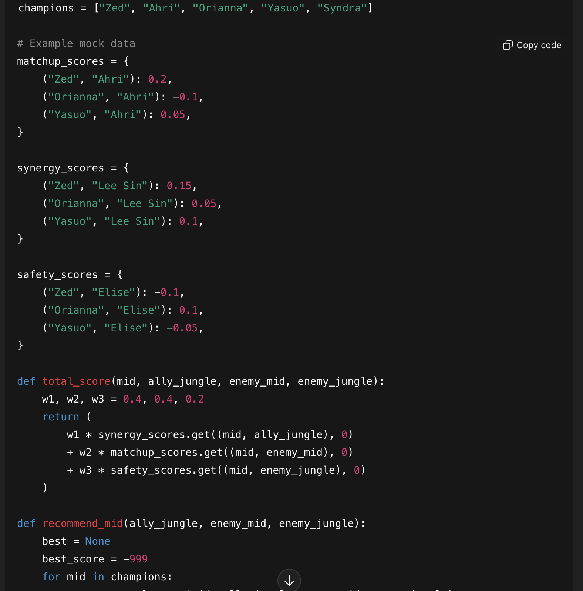

- Best Project
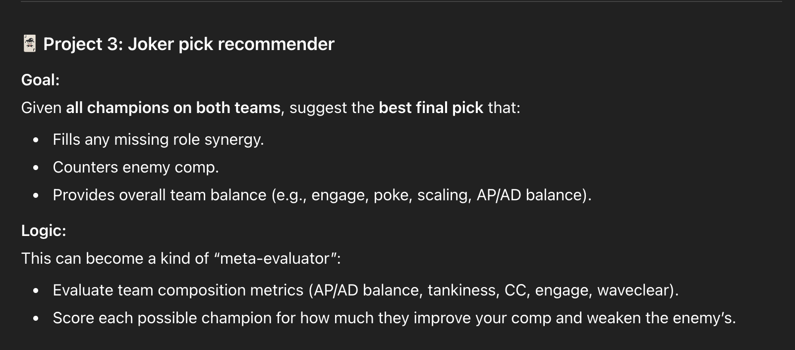
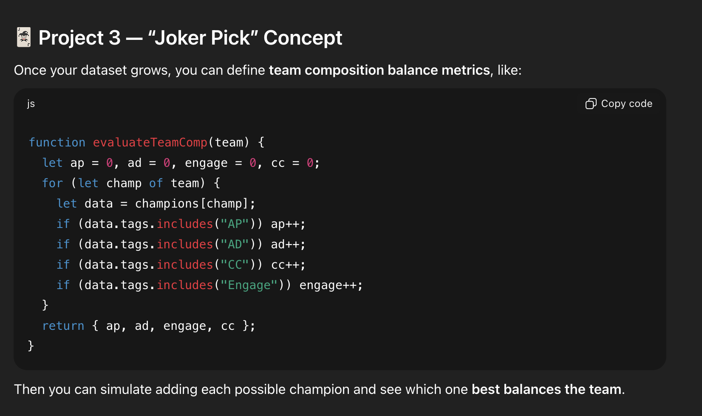

Ultimately, I am going to build a programme that helps me choose a character based on my team's pick and my opponent's pick so that the favour tilts towards our team. 

###Good outcome:
I want my programme to choose a best mid lane counter pick when I type in a champion of opponent's pick

###Better outcome:
I want my programme to to pick me a champion that chooses the best mid lane champion according to my jungler, enemies jungler and enemies mid laner

###Best outcome:
I want a programme that chooses a best champion according to my whole team and other team so that they call it the joker pick. As in the champion that the programme chooses changes the dynamic of the team balance towards our team.

Steps:
I need to build a databse based on Community APIs like OP.gg, League of graphs and riot APIs. As there are 172 champions, I am going to split them into 4 days, 43 champioins per day, spreaad among 2 weeks. This would be on the 16th and 23rd of November consecutively. 

For the combination of my databse and my good project, it will be by 27th of November
For the construction of my Better project, it will be by the 30th of November
For the construction of my Best project, it will be by the 3rd of December. 

