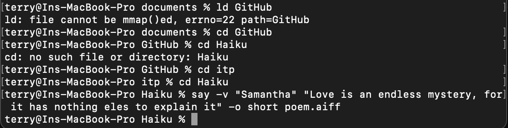
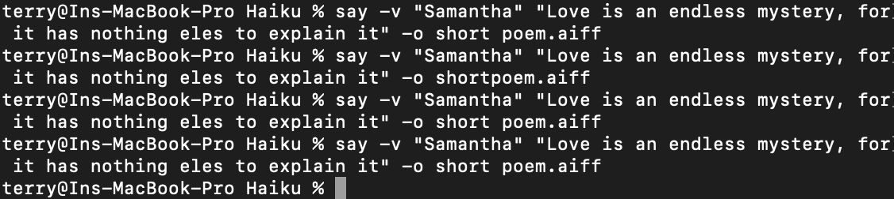
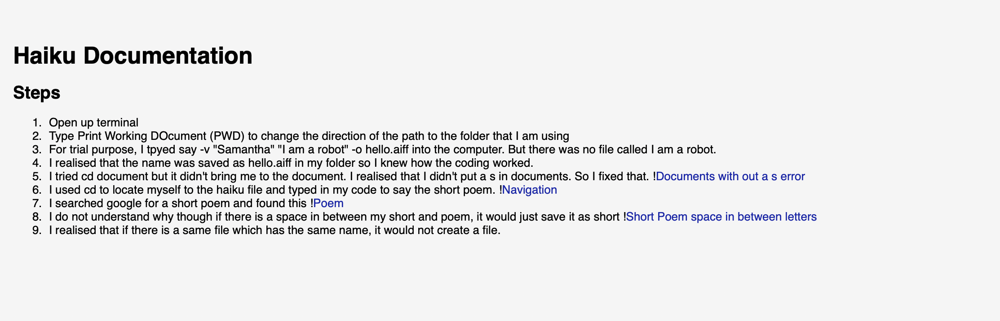
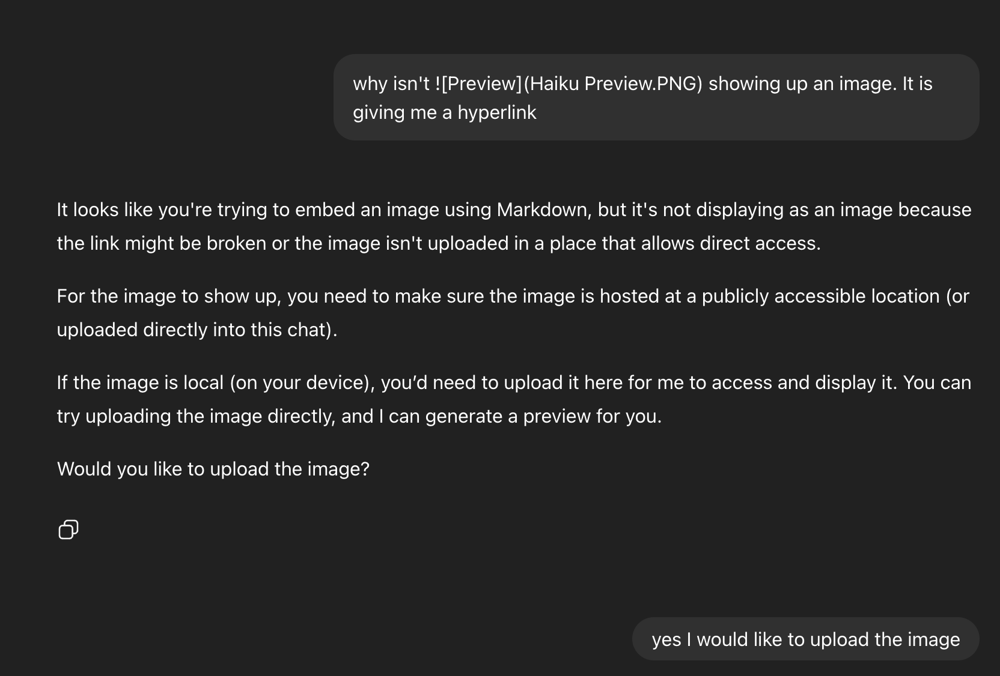
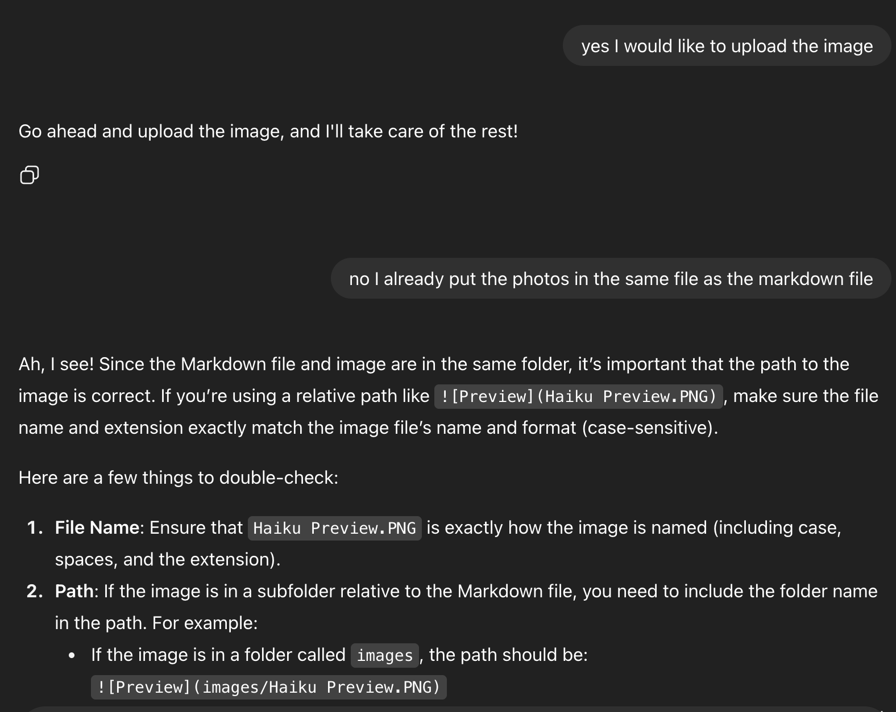
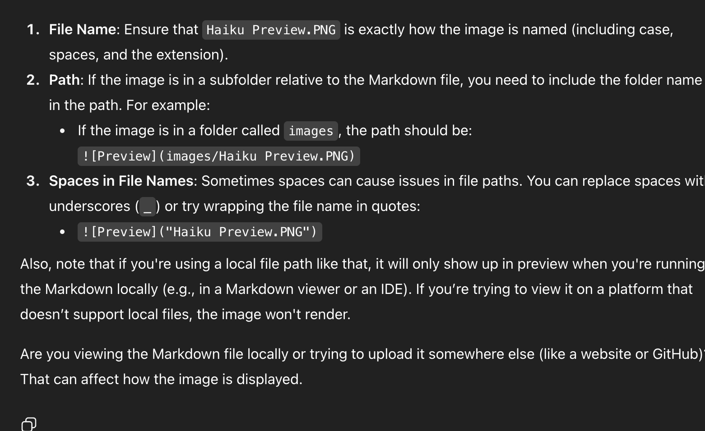

# Haiku Documentation
## Steps

1. Open up terminal
2. Type Print Working DOcument (PWD) to change the direction of the path to the folder that I am using
3. For trial purpose, I tpyed say -v "Samantha" "I am a robot" -o hello.aiff into the computer. But there was no file called I am a robot.
4. I realised that the name was saved as hello.aiff in my folder so I knew how the coding worked.
5. I tried cd document but it didn't bring me to the document. I realised that I didn't put a s in documents. So I fixed that. 

6. I used cd to locate myself to the haiku file and typed in my code to say the short poem. 

7. I searched google for a short poem and found this

8. I do not understand why though if there is a space in between my short and poem, it would just save it as short

9. I realised that if there is a same file which has the same name, it would not create a file. 
10. When I checked the preview it showed as this and I am not understanding why it shows like this. 
 
11. I have tried things in chatgpt but it doesn't work.
 
 
  

