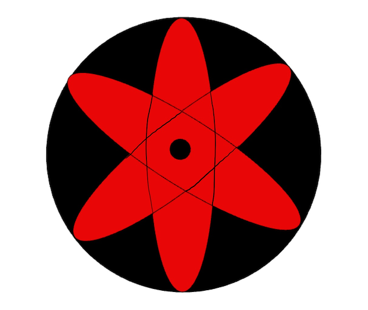
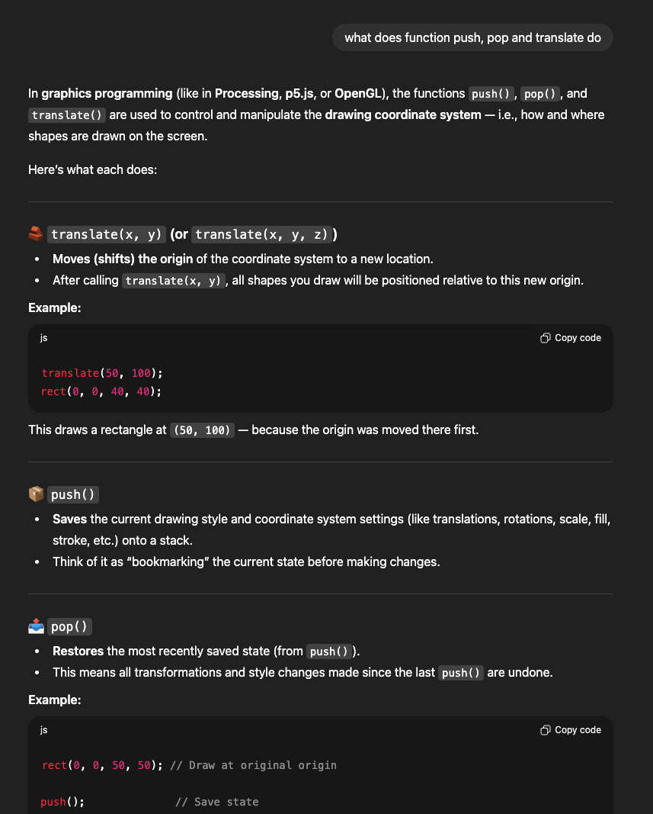
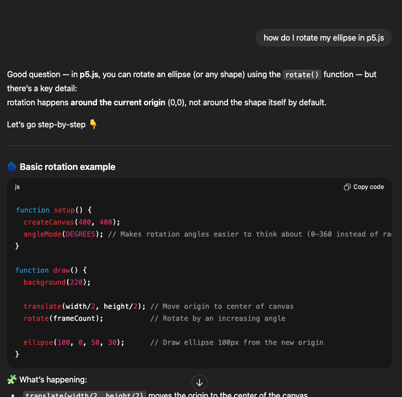
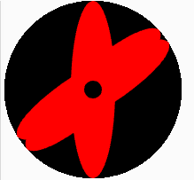
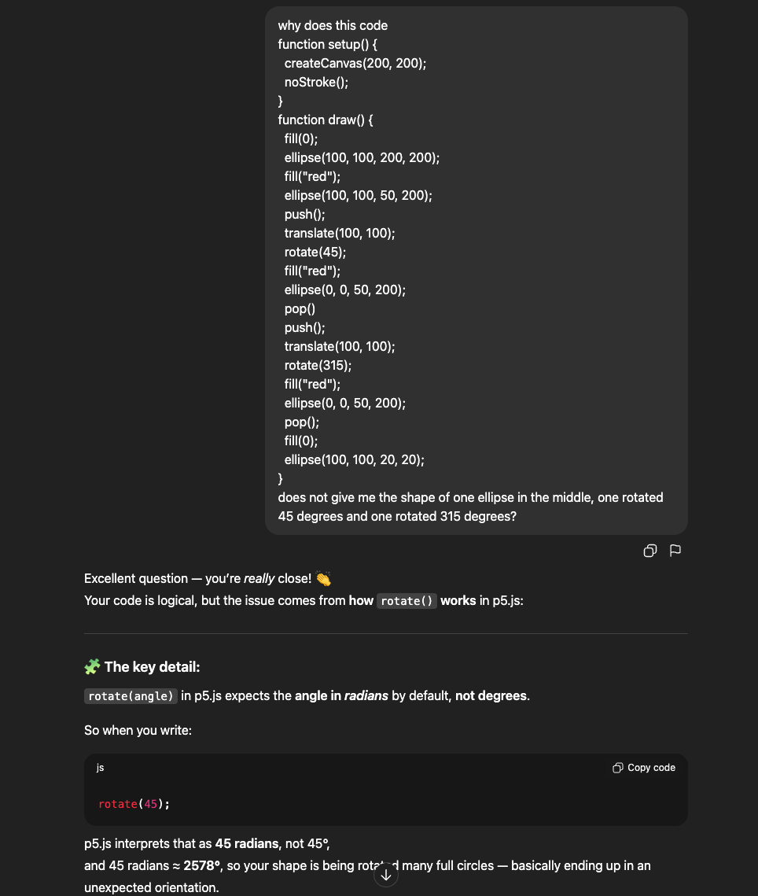
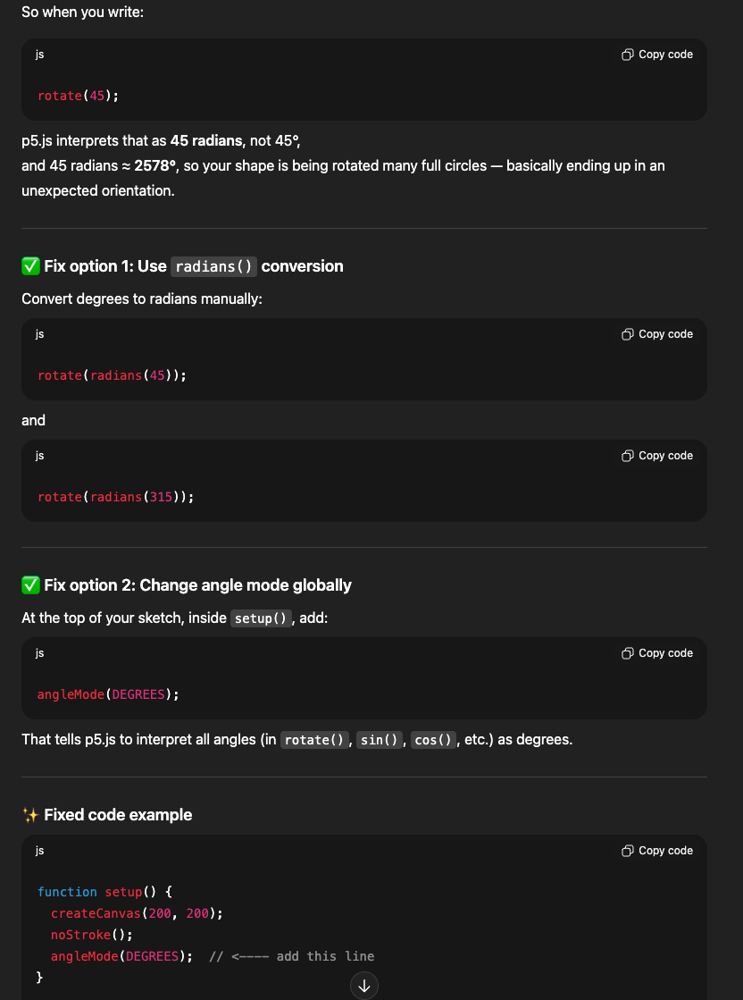
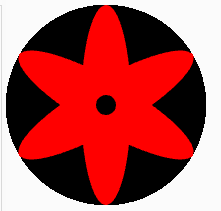
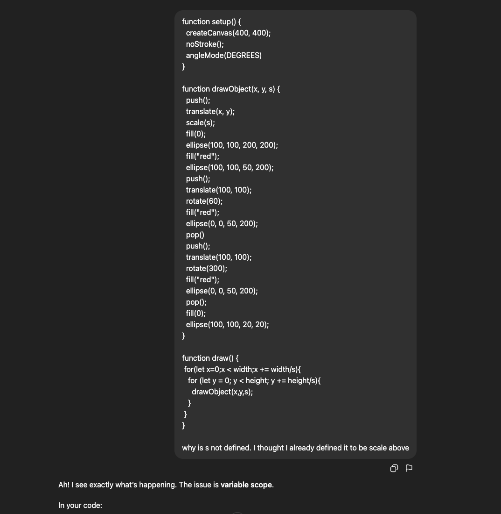
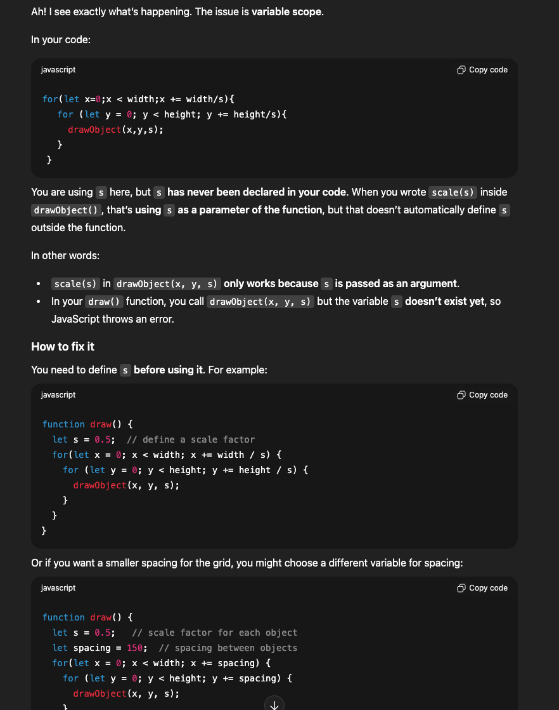

# MIDTERM PROJECT

##Phase 1
I used Sketch.io to create the basic shapes of my drawing, mangakyo sharingan from animiation naruto. As this website only provides basic shapes, I could not draw in the missing lines in between the shapes. Thus I moved it to my Ipad to fill the lines in by my self and transferred them back to my computer. Here is an imgae of it.

##Phase 2
First to psudo code, I need a large black circle with three ovals on top of it with a smaller circle in the middle. So I would need to follow these steps. 
First, I made a canvas size of 300 by 300 with no strokes by using code

`
function setup() {
  createCanvas(200, 200); 
  noStroke(); 
}
`

Then I created a large black circle by using the code

`
function draw() {
  fill(0); 
  ellipse(100, 100, 200, 200); 
`

which gave me a black circle which filled up the canvas. 

After that, I used the code 

`
fill(red); 
ellipse(100, 100, 50, 200);
`

to create my first oval shaped that went across the middle where I thought it would work but it did not as there was an error with my colour code. As I was working with sung min, he looked over and told me that I needed to put "red" instead of just red because he told me that if I just put (red), then it would be a variable instead of a string. Thus I used 

`
fill("red"); 
ellipse(100, 100, 50, 200);
`

and it worked. 
The problem came after this. As my other two ovals were sllanted, I needed to find a way to draw that. I thought hard and went through the code along but could not find anything that could help me. I was just like how many more do I have to do and I read the phase 3 part where there were code function push, function translate and function pop. I asked chatgpt what they did and it gave me this. 

Then I searched how I could rotate my shape in chatgpt and it said that I could use function rotate() but I needed a starting point where I could start my rotation where I could use function translate(x,y) to set my starting point. The picture from chatgpt is this:

So combining these, I used the code 

`
function setup() {
  createCanvas(200, 200); 
  noStroke(); 
}
function draw() {
  fill(0); 
  ellipse(100, 100, 200, 200); 
  fill("red"); 
  ellipse(100, 100, 50, 200);
  push();                 
  translate(100, 100);   
  rotate(45);            
  fill("red");
  ellipse(0, 0, 50, 200); 
  pop()
  push();                 
  translate(100, 100);   
  rotate(315);            
  fill("red");
  ellipse(0, 0, 50, 200); 
  pop(); 
  fill(0); 
  ellipse(100, 100, 20, 20);
}

but it did not give me the shape I want but this shape. 

I wanted to know what was wrong and still could not figure it out. Thus I asked chatgpt again and it gave me this.
According to chatgpt, the codes are usually in radians and not in degrees and I needed to add the code andleMode(DEGREES) for it to registers as degrees. 

Thus I changed the radians to degrees and used the code 

`
function setup() {
  createCanvas(200, 200); 
  noStroke(); 
  angleMode(DEGREES)
}
function draw() {
  fill(0); 
  ellipse(100, 100, 200, 200); 
  fill("red"); 
  ellipse(100, 100, 50, 200);
  push();                 
  translate(100, 100);   
  rotate(60);            
  fill("red");
  ellipse(0, 0, 50, 200); 
  pop()
  push();                 
  translate(100, 100);   
  rotate(300);            
  fill("red");
  ellipse(0, 0, 50, 200); 
  pop(); 
  fill(0); 
  ellipse(100, 100, 20, 20);
}
`

and it gave me this:

##Phase 3
For Phase 3, I just coppied the code from the README.md file from Professor rachael's file and pasted them and the code goes like this

`
function setup() {
  createCanvas(400, 400);
  noStroke(); 
  angleMode(DEGREES)
}

function drawObject(x, y, s) {
  push();
  translate(x, y);
  scale(s);
  fill(0); 
  ellipse(100, 100, 200, 200); 
  fill("red"); 
  ellipse(100, 100, 50, 200);
  push();                 
  translate(100, 100);   
  rotate(60);            
  fill("red");
  ellipse(0, 0, 50, 200); 
  pop()
  push();                 
  translate(100, 100);   
  rotate(300);            
  fill("red");
  ellipse(0, 0, 50, 200); 
  pop(); 
  fill(0); 
  ellipse(100, 100, 20, 20);
}

function draw() {
  drawObject(0, 0, 1);
  drawObject(0, 200, 1);
}
`
##Phase 4
I honestly do not understand what this means. Like I had to make this piscture appear many times. I first read through and found out that I needed to use nested for-loops. Thus I added

`
function draw() {
 for(let x=0;x < width;x += width/s){
   for (let y = 0; y < height; y += height/s){
     drawObject(x,y,s);
`

and ran it but it says that s was not defined. I could not understand why because I already defined s to be scale above. Thus I asked chat gpt and it gave me this,

So from here, I know that I needed to define s again when I write the function draw(). Thus I defined s to be 7 because it was my lucky number but it just seems to be zooming into the picture. I am so lost...
